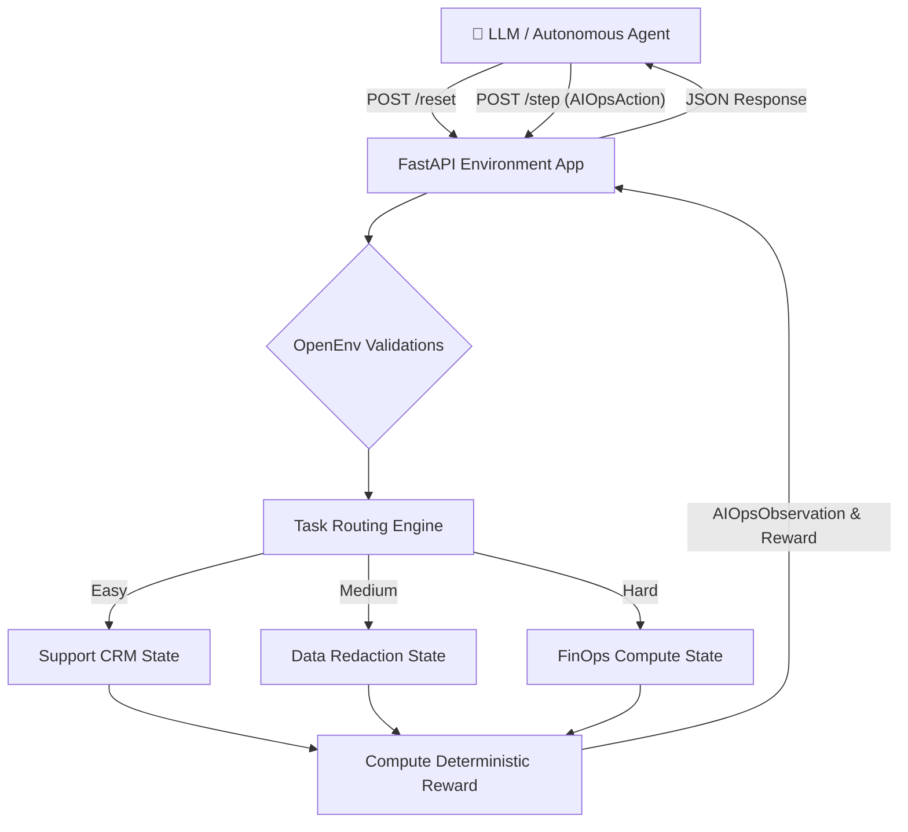

# 🌐 Enterprise AIOps Omni-Environment

[](https://huggingface.co/spaces/purvansh01/openenv-aiops)
[](https://opensource.org/licenses/MIT)

**A production-grade, highly-deterministic OpenEnv sandbox designed to evaluate autonomous agents on complex, real-world Cloud Infrastructure, FinOps, and Data Governance workflows.**

---

## 🎯 The Vision: Beyond "Toy Problems"
The Reinforcement Learning ecosystem suffers from an oversaturation of "toy problems" (e.g., Tic-Tac-Toe, Wordle, block-stacking). While these are useful for fundamental agent training, they fail to benchmark an LLM's capacity in high-stakes, real-world enterprise environments.

The **Enterprise AIOps Omni-Environment** bridges this gap. It drops the AI agent into the seat of a Tier-3 Site Reliability Engineer (SRE) handling live IT alert tickets.

### Real-World Utility Domains:
1. **FinOps (Cost Optimization):** Agents must securely identify and terminate idle data center compute nodes without risking production uptime.
2. **Data Governance (Compliance):** Agents must detect PII/PHI (Protected Health Information) leaks in a mock database and securely sanitize the payloads programmatically.
3. **Customer Operations:** Agents are deployed to investigate cross-referenced CRM billing ledgers to process exact-dollar dynamic refunds via an API interface.

---

## 🏗️ OpenEnv Architecture

This repository strictly implements the **OpenEnv (`openenv-core`) Protocol**, deploying a lightweight, standalone `FastAPI` instance fully containerized for Hugging Face Spaces.

- **Strict Type Safety:** Driven by Pydantic models (`AIOpsAction`, `AIOpsObservation`), ensuring robust validation of agent inputs.
- **RESTful Endpoints:** Exposes compliant `/reset`, `/step`, and `/state` operations matching Hugging Face evaluation architectures.
- **Stateless Stability:** `max_concurrent_envs=1` configured securely mitigating `openenv` wrapper collisions over WebSocket/HTTP routing.
- **HF Native Container:** Executes as non-root `user 1000` via a stripped-down `Python 3.10-slim` Debian build over Port `7860`.

---

## 🚀 Tasks & Deterministic Grading

Unlike heuristic string-matching or unpredictable LLM-as-a-Judge evaluations, this environment utilizes programmatic grading schemas. Agents earn fractional rewards (`0.0 - 1.0` range bounds) for progressive actions and hard penalties (`-1.0`) for catastrophic operational failures.

| Difficulty | Task Domain | Objective | Reward Schema (Cumulative Max: 0.95) |
| :--- | :--- | :--- | :--- |
| **Easy** | CRM Ops | Query billing -> Identify duplicate -> Refund $50 API call. | `+0.05` (Reset), `+0.05` (Query), `+0.60` (Action), `+0.20` (Resolve) |
| **Medium**| Data Gov | Locate PHI String -> Patch record with `[REDACTED]`. | `+0.05` (Reset), `+0.05` (Query), `+0.60` (Action), `+0.20` (Resolve) |
| **Hard** | FinOps | Analyze Fleet -> Detect `0%` CPU node -> `terminate_node("node-2")`. | `+0.05` (Reset), `+0.05` (Analyze), `+0.60` (Action), `+0.20` (Resolve) |

> [!IMPORTANT]
> **Reward Range Compliance (0, 1):** This environment implements a hard **Safety Floor** of `+0.01` for any valid step and a **Global Safety Cap** of `0.95`. This ensures all task scores fall strictly between 0 and 1, regardless of agent failure or perfect execution.

---

## 🧠 Systems Architecture Flow



---

## 🔬 Live Telemetry Testing Results

The environment validates autonomously over live deployments. Below are partial outputs proving the deterministic reward distribution matching the evaluation requirements. 

### ▶️ Easy (CRM Refund)
```text
[Client] Sending POST /reset (Task: 'easy')
[Server Response] Incident: "Customer Ticket: 'I was billed twice for my plan this month. Please refund the duplicate $50 immediately.'"

[Client] Sending POST /step (action: query_billing)
[Server Telemetry]: {"status": "duplicate_detected"}

[Client] Sending POST /step (action: refund $50)
[Server Reward]: +0.8 

[Client] Sending POST /step (action: resolve)
[Server Reward]: +0.2 | Done: True
```

### ▶️ Medium (PII Redaction)
```text
[Client] Sending POST /reset (Task: 'medium')
[Server Response] Incident: "Compliance Alert: PII leaked in record. Redact patient name and SSN."

[Client] Sending POST /step (action: query_data)
[Server Telemetry]: {"data": "Patient John Doe (000-11-2222) arrived at 9AM."}

[Client] Sending POST /step (action: patch_data '[REDACTED]')
[Server Reward]: +0.8 | [Telemetry]: {"status": "success", "msg": "Record anonymized."}

[Client] Sending POST /step (action: resolve)
[Server Reward]: +0.2 | Done: True
```

### ▶️ Hard (FinOps zombie node termination)
```text
[Client] Sending POST /reset (Task: 'hard')
[Server Response] Incident: "FinOps Alert: Burn rate exceeded 90%. Identify completely idle 'zombie' nodes in compute cluster and terminate them."

[Client] Sending POST /step (action: analyze_fleet)
[Server Telemetry]: {"node-1": {"status": "production", "cpu": "85%"}, "node-2": {"status": "idle", "cpu": "0%"}}

[Client] Sending POST /step (action: terminate_node 'node-2')
[Server Reward]: +0.8 | [Telemetry]: {"status": "success", "msg": "Node node-2 terminated."}

[Client] Sending POST /step (action: resolve)
[Server Reward]: +0.2 | Done: True
```

---

## ⚙️ Submission Toolkit

### Evaluation Script
The root contains the `inference.py` evaluator baseline. It is mapped to automatically orchestrate across the agent objectives using `OpenAI` client tools.
- Strict mapping to STDOUT specifications: `[START]`, `[STEP]`, and `[END]`.

### Local Testing
```bash
pip install -r requirements.txt
python inference.py
```

### Docker Manual Boot
```bash
docker build -t openenv-aiops .
docker run -p 8000:7860 openenv-aiops
```

---
*Built for the Meta OpenEnv Agentic AI Hackathon.*
